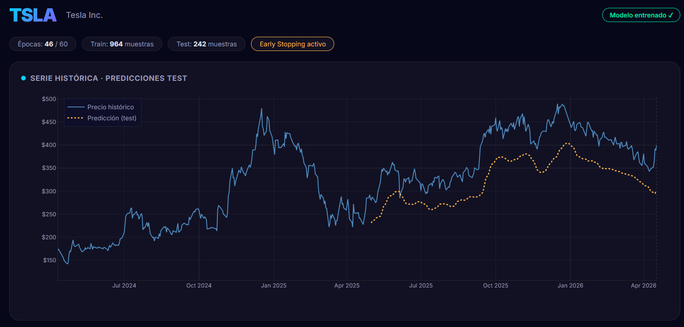

# StockSense LSTM

Aplicación web interactiva para predicción de precios de acciones bursátiles usando redes neuronales LSTM (Long Short-Term Memory) con estimación de incertidumbre mediante Monte Carlo Dropout.


---

## Capturas

### TSLA — Tesla Inc.


### AAPL — Apple Inc.


---

## Descripción

StockSense entrena un modelo LSTM en tiempo real sobre datos históricos de Yahoo Finance y genera:

- **Predicción sobre datos de test** — evalúa la capacidad predictiva del modelo sobre el 20% de datos reservados, mostrando métricas cuantitativas (MAE, RMSE, MAPE, R²).
- **Pronóstico futuro con incertidumbre** (opcional) — proyecta el precio N días hacia el futuro usando Monte Carlo Dropout, generando bandas de confianza al 68% y 95% que reflejan la incertidumbre del modelo.

El entrenamiento es asíncrono: el backend lanza un hilo, el frontend muestra el progreso en tiempo real (fase actual, época, loss) y renderiza los resultados con gráficos interactivos Plotly.

## Arquitectura del modelo

```
Input (window días)
      |
LSTM(100 units, dropout=0.2)  ← return_sequences=True
      |
LSTM(50 units, dropout=0.2)
      |
Dense(25, ReLU)
      |
Dropout(0.15)
      |
Dense(1, Linear)  ← precio predicho
```

| Componente | Detalle |
|---|---|
| **Optimizador** | Adam (lr=0.0005, clipnorm=1.0) |
| **Loss** | MSE (Mean Squared Error) |
| **Regularización** | EarlyStopping (patience=10), ReduceLROnPlateau (patience=5, factor=0.5) |
| **Datos** | Precios de cierre ajustados vía Yahoo Finance (`yfinance`) |
| **Escalado** | MinMaxScaler [0, 1] |
| **División** | 80% train / 20% test, temporal (sin shuffling para evitar data leakage) |
| **Incertidumbre** | Monte Carlo Dropout: 40 forward passes con `training=True` en inferencia |

### Por qué estas decisiones

- **Learning rate 0.0005 + clipnorm=1.0**: un LR bajo con gradient clipping produce curvas de entrenamiento suaves y evita explosiones de gradiente, que son frecuentes en LSTM con series financieras volátiles.
- **Sin `recurrent_dropout`**: aunque puede regularizar, introduce ruido excesivo en las conexiones recurrentes, produce curvas erráticas e impide la aceleración cuDNN. El dropout explícito entre capas es suficiente.
- **EarlyStopping con patience=10**: con un LR conservador, el modelo necesita más épocas para converger. Una paciencia alta evita detener el entrenamiento prematuramente.
- **`shuffle=False`**: obligatorio en series temporales para preservar el orden cronológico y evitar data leakage entre train y validation.

## Estructura del proyecto

```
lstm_prediction/
├── app.py                      # Backend FastAPI (API REST + jobs asíncrono)
├── lstm_core.py                # Pipeline ML (LSTMPredictor class)
├── requirements.txt            # Dependencias Python
├── templates/
│   └── index.html              # Shell HTML (Jinja2)
├── static/
│   ├── css/style.css           # Tema dark glassmorphism
│   └── js/app.js               # Lógica frontend + Plotly charts
└── prediccion_acciones_lstm.py # Versión inicial standalone (script de consola con matplotlib)
```

> **Nota:** `prediccion_acciones_lstm.py` es la versión original del proyecto, un script de consola que genera gráficas con matplotlib. Se conserva como referencia de la evolución hacia la aplicación web actual (`lstm_core.py` + `app.py`).

## Instalación y ejecución

### Requisitos previos

- Python 3.10+
- pip

### Pasos

```bash
# Clonar el repositorio
git clone https://github.com/DavidD1104/lstm-stock-predictor.git
cd lstm_prediction

# Crear entorno virtual (recomendado)
python -m venv venv
source venv/bin/activate        # Linux/Mac
venv\Scripts\activate           # Windows

# Instalar dependencias
pip install -r requirements.txt

# Lanzar el servidor
python app.py
```

La aplicación estará disponible en **http://localhost:8000**.

## Uso

1. **Selecciona una acción** del panel lateral (25 tickers disponibles agrupados por sector).
2. **Aplica la configuración recomendada** (opcional) — el sistema sugiere parámetros optimizados según la volatilidad y comportamiento histórico de cada ticker.
3. **Ajusta los parámetros** manualmente si lo prefieres:
   - **Rango de datos**: fechas de inicio y fin para los datos históricos.
   - **Épocas**: máximo de épocas de entrenamiento (10-100). EarlyStopping detiene si el modelo deja de mejorar.
   - **Ventana temporal**: días de contexto que el modelo usa para cada predicción (10-60).
   - **Pronóstico futuro**: activa/desactiva la generación de pronóstico con Monte Carlo Dropout y selecciona el horizonte (5-30 días).
4. **Pulsa "Entrenar Modelo"** y observa el progreso en tiempo real:
   - Fases: descarga de datos → preparación → construcción → entrenamiento → evaluación → pronóstico.
   - Época actual, loss y val_loss actualizados en cada época.
5. **Explora los resultados**:
   - Gráfico principal interactivo con histórico, predicciones test y pronóstico futuro (zoom, pan, hover).
   - Métricas: MAE, RMSE, MAPE, R².
   - Curvas de entrenamiento (train loss vs val loss).
   - Histograma de distribución de errores.
   - Resumen del entrenamiento (épocas ejecutadas, early stopping, tamaño train/test).

## API REST

| Endpoint | Método | Descripción |
|---|---|---|
| `/` | GET | Interfaz web |
| `/api/stocks` | GET | Catálogo de acciones disponibles |
| `/api/train` | POST | Inicia entrenamiento (devuelve `job_id`) |
| `/api/status/{job_id}` | GET | Progreso del entrenamiento (fase, época, loss) |
| `/api/result/{job_id}` | GET | Resultado completo (métricas, predicciones, pronóstico) |

### Ejemplo de request

```json
POST /api/train
{
  "ticker": "AAPL",
  "start_date": "2021-01-01",
  "end_date": "2026-04-18",
  "epochs": 50,
  "window": 40,
  "forecast_days": 14,
  "include_forecast": true
}
```

## Acciones disponibles

| Sector | Tickers |
|---|---|
| Tecnología | AAPL, MSFT, GOOGL, NVDA, META, ADBE, CRM, INTC, AMD |
| Consumo | TSLA, AMZN, NFLX, NKE, MCD |
| Finanzas | JPM, GS, V, MA |
| Salud | JNJ, PFE, UNH |
| Energía | XOM, CVX |
| Entretenimiento | DIS, SPOT |

Cada ticker tiene parámetros recomendados en el frontend (épocas, ventana, horizonte, años de datos) ajustados a su perfil de volatilidad.

## Métricas de evaluación

| Métrica | Qué mide |
|---|---|
| **MAE** | Error absoluto medio en dólares — cuánto se equivoca el modelo de media |
| **RMSE** | Error cuadrático medio — penaliza errores grandes más que MAE |
| **MAPE** | Error porcentual medio — error relativo al precio (comparable entre acciones) |
| **R²** | Coeficiente de determinación — 1.0 = predicción perfecta, 0.0 = predice la media |

## Monte Carlo Dropout

La estimación de incertidumbre se realiza ejecutando el modelo 40 veces con dropout activo (`training=True` en inferencia). Cada pasada produce una predicción ligeramente diferente debido a las neuronas desactivadas aleatoriamente. La distribución resultante permite calcular:

- **Media**: pronóstico central.
- **Banda 68% (±1σ)**: intervalo donde se espera el precio con ~68% de probabilidad.
- **Banda 95% (±2σ)**: intervalo más conservador con ~95% de probabilidad.

Bandas anchas = alta incertidumbre del modelo. Bandas estrechas = mayor confianza.

## Stack tecnológico

| Capa | Tecnología |
|---|---|
| ML | TensorFlow/Keras, scikit-learn, NumPy, pandas |
| Datos | yfinance (Yahoo Finance API) |
| Backend | FastAPI, Uvicorn, Pydantic v2 |
| Frontend | Vanilla JS, Plotly.js, CSS custom properties |
| Plantillas | Jinja2 |

## Limitaciones

- **No es asesoramiento financiero.** Este modelo es demostrativo y educativo. Los mercados financieros son inherentemente impredecibles a corto plazo.
- **Datos univariantes**: el modelo solo usa precios de cierre. No incorpora volumen, indicadores técnicos, sentimiento, ni datos macroeconómicos.
- **Sin persistencia**: los modelos entrenados se pierden al reiniciar el servidor. Cada entrenamiento parte de cero.
- **Un entrenamiento a la vez**: el servidor limita a un job concurrente para evitar saturar CPU/RAM.
- **Sesgo temporal**: el modelo aprende patrones del pasado y asume que se mantendrán. Eventos sin precedentes (crashes, pandemias) no son predecibles.

## Licencia

MIT
